# Sơ Đồ Use Case - Hệ Thống Quản Lý Nhà Hàng

## Mô Tả
Sơ đồ use case mô tả các chức năng chính của hệ thống quản lý nhà hàng, bao gồm các actor và use case tương ứng.

## Các Actor

1. **Khách Hàng (Customer)** - Người dùng đã đăng ký tài khoản
2. **Khách Vãng Lai (Guest)** - Người dùng chưa đăng ký, có thể đặt hàng
3. **Nhân Viên (Employee)** - Nhân viên nhà hàng
4. **Quản Lý (Manager)** - Quản lý nhà hàng
5. **Quản Trị Viên (Admin)** - Quản trị viên hệ thống

---

## Sơ Đồ Use Case (PlantUML)

```plantuml
@startuml Restaurant Management System - Use Case Diagram

!define RECTANGLE class

left to right direction

actor "Khách Hàng\n(Customer)" as Customer
actor "Khách Vãng Lai\n(Guest)" as Guest
actor "Nhân Viên\n(Employee)" as Employee
actor "Quản Lý\n(Manager)" as Manager
actor "Quản Trị Viên\n(Admin)" as Admin

rectangle "Xác Thực & Quản Lý Người Dùng" {
  usecase "Đăng Ký" as UC_Register
  usecase "Đăng Nhập" as UC_Login
  usecase "Đăng Xuất" as UC_Logout
  usecase "Quản Lý Hồ Sơ" as UC_ManageProfile
  usecase "Đổi Mật Khẩu" as UC_ChangePassword
  usecase "Quên Mật Khẩu" as UC_ForgotPassword
  usecase "Quản Lý Nhân Viên" as UC_ManageEmployees
  usecase "Quản Lý Ca Làm Việc" as UC_ManageShifts
}

rectangle "Quản Lý Thực Đơn" {
  usecase "Xem Thực Đơn" as UC_ViewMenu
  usecase "Tìm Kiếm Món Ăn" as UC_SearchMenu
  usecase "Tạo Món Ăn" as UC_CreateMenuItem
  usecase "Cập Nhật Món Ăn" as UC_UpdateMenuItem
  usecase "Xóa Món Ăn" as UC_DeleteMenuItem
  usecase "Upload Hình Ảnh Món Ăn" as UC_UploadMenuItemImage
}

rectangle "Quản Lý Giỏ Hàng" {
  usecase "Thêm Vào Giỏ Hàng" as UC_AddToCart
  usecase "Xem Giỏ Hàng" as UC_ViewCart
  usecase "Cập Nhật Giỏ Hàng" as UC_UpdateCart
  usecase "Xóa Khỏi Giỏ Hàng" as UC_RemoveFromCart
  usecase "Áp Dụng Mã Giảm Giá" as UC_ApplyCoupon
  usecase "Thanh Toán" as UC_Checkout
}

rectangle "Quản Lý Đơn Hàng" {
  usecase "Tạo Đơn Hàng" as UC_CreateOrder
  usecase "Xem Đơn Hàng" as UC_ViewOrders
  usecase "Theo Dõi Đơn Hàng" as UC_TrackOrder
  usecase "Hủy Đơn Hàng" as UC_CancelOrder
  usecase "Đánh Giá Đơn Hàng" as UC_RateOrder
  usecase "Đặt Lại Đơn Hàng" as UC_Reorder
  usecase "Quản Lý Đơn Hàng (Admin)" as UC_ManageOrdersAdmin
  usecase "Cập Nhật Trạng Thái Đơn" as UC_UpdateOrderStatus
  usecase "Tạo Đơn Hàng Tại Quầy" as UC_CreateAdminOrder
}

rectangle "Quản Lý Đặt Bàn" {
  usecase "Tìm Bàn Trống" as UC_SearchTables
  usecase "Đặt Bàn" as UC_CreateReservation
  usecase "Xem Đặt Bàn" as UC_ViewReservations
  usecase "Cập Nhật Đặt Bàn" as UC_UpdateReservation
  usecase "Hủy Đặt Bàn" as UC_CancelReservation
  usecase "Check-in" as UC_Checkin
  usecase "Check-out" as UC_CheckoutReservation
  usecase "Đánh Giá Dịch Vụ" as UC_RateReservation
  usecase "Quản Lý Bàn (Admin)" as UC_ManageTables
  usecase "Cập Nhật Trạng Thái Bàn" as UC_UpdateTableStatus
}

rectangle "Quản Lý Đơn Tại Bàn (Dine-in)" {
  usecase "Tạo Đơn Tại Bàn" as UC_CreateDineInOrder
  usecase "Xem Đơn Theo Bàn" as UC_ViewTableOrders
  usecase "Cập Nhật Trạng Thái Đơn" as UC_UpdateDineInStatus
  usecase "Đánh Dấu Đã Phục Vụ" as UC_MarkServed
  usecase "Thanh Toán Tổng Cho Bàn" as UC_CompleteTablePayment
}

rectangle "Quản Lý Đơn Mang Đi (Pickup)" {
  usecase "Tạo Đơn Mang Đi" as UC_CreatePickupOrder
  usecase "Xác Nhận Đơn" as UC_ConfirmPickup
  usecase "Đánh Dấu Sẵn Sàng" as UC_MarkPickupReady
  usecase "Hoàn Thành Đơn" as UC_CompletePickup
}

rectangle "Quản Lý Đánh Giá" {
  usecase "Tạo Đánh Giá" as UC_CreateReview
  usecase "Xem Đánh Giá" as UC_ViewReviews
  usecase "Cập Nhật Đánh Giá" as UC_UpdateReview
  usecase "Xóa Đánh Giá" as UC_DeleteReview
  usecase "Xem Đánh Giá Món Ăn" as UC_ViewMenuItemReviews
  usecase "Xem Gợi Ý" as UC_GetRecommendations
}

rectangle "Quản Lý Kho" {
  usecase "Xem Kho" as UC_ViewInventory
  usecase "Tạo Vật Liệu" as UC_CreateInventory
  usecase "Cập Nhật Kho" as UC_UpdateInventory
  usecase "Xóa Vật Liệu" as UC_DeleteInventory
  usecase "Cập Nhật Số Lượng" as UC_UpdateInventoryQuantity
  usecase "Xem Báo Cáo Kho" as UC_ViewInventoryReport
}

rectangle "Hệ Thống Chat" {
  usecase "Gửi Tin Nhắn" as UC_SendMessage
  usecase "Xem Cuộc Trò Chuyện" as UC_ViewConversations
  usecase "Phân Công Cuộc Trò Chuyện" as UC_AssignConversation
  usecase "Đóng/Mở Cuộc Trò Chuyện" as UC_ManageConversation
}

rectangle "Quản Lý Địa Chỉ" {
  usecase "Thêm Địa Chỉ" as UC_AddAddress
  usecase "Xem Địa Chỉ" as UC_ViewAddresses
  usecase "Cập Nhật Địa Chỉ" as UC_UpdateAddress
  usecase "Xóa Địa Chỉ" as UC_DeleteAddress
  usecase "Đặt Địa Chỉ Mặc Định" as UC_SetDefaultAddress
}

rectangle "Chương Trình Khách Hàng Thân Thiết" {
  usecase "Xem Thông Tin Tích Điểm" as UC_ViewLoyalty
  usecase "Xác Thực Mã Khuyến Mãi" as UC_ValidatePromotionCode
}

rectangle "Thống Kê & Báo Cáo" {
  usecase "Xem Thống Kê Đơn Hàng" as UC_ViewOrderStats
  usecase "Xem Thống Kê Tổng Quan" as UC_ViewDashboard
  usecase "Xem Thống Kê Đặt Bàn" as UC_ViewReservationStats
  usecase "Xem Thống Kê Nhân Viên" as UC_ViewEmployeeStats
  usecase "Xem Báo Cáo" as UC_ViewReports
}

' Customer connections
Customer --> UC_Register
Customer --> UC_Login
Customer --> UC_Logout
Customer --> UC_ManageProfile
Customer --> UC_ChangePassword
Customer --> UC_ForgotPassword
Customer --> UC_ViewMenu
Customer --> UC_SearchMenu
Customer --> UC_AddToCart
Customer --> UC_ViewCart
Customer --> UC_UpdateCart
Customer --> UC_RemoveFromCart
Customer --> UC_ApplyCoupon
Customer --> UC_Checkout
Customer --> UC_CreateOrder
Customer --> UC_ViewOrders
Customer --> UC_TrackOrder
Customer --> UC_CancelOrder
Customer --> UC_RateOrder
Customer --> UC_Reorder
Customer --> UC_SearchTables
Customer --> UC_CreateReservation
Customer --> UC_ViewReservations
Customer --> UC_UpdateReservation
Customer --> UC_CancelReservation
Customer --> UC_Checkin
Customer --> UC_CheckoutReservation
Customer --> UC_RateReservation
Customer --> UC_CreateDineInOrder
Customer --> UC_ViewTableOrders
Customer --> UC_CreatePickupOrder
Customer --> UC_CreateReview
Customer --> UC_ViewReviews
Customer --> UC_UpdateReview
Customer --> UC_DeleteReview
Customer --> UC_ViewMenuItemReviews
Customer --> UC_GetRecommendations
Customer --> UC_ViewInventory
Customer --> UC_SendMessage
Customer --> UC_ViewConversations
Customer --> UC_AddAddress
Customer --> UC_ViewAddresses
Customer --> UC_UpdateAddress
Customer --> UC_DeleteAddress
Customer --> UC_SetDefaultAddress
Customer --> UC_ViewLoyalty
Customer --> UC_ValidatePromotionCode
Customer --> UC_ViewOrderStats
Customer --> UC_ViewReservationStats

' Guest connections
Guest --> UC_ViewMenu
Guest --> UC_SearchMenu
Guest --> UC_AddToCart
Guest --> UC_ViewCart
Guest --> UC_UpdateCart
Guest --> UC_RemoveFromCart
Guest --> UC_Checkout
Guest --> UC_CreateOrder
Guest --> UC_TrackOrder
Guest --> UC_CreateDineInOrder
Guest --> UC_ViewTableOrders
Guest --> UC_ViewMenuItemReviews

' Employee connections
Employee --> UC_Login
Employee --> UC_Logout
Employee --> UC_ManageProfile
Employee --> UC_ViewMenu
Employee --> UC_ViewOrders
Employee --> UC_UpdateOrderStatus
Employee --> UC_ViewTableOrders
Employee --> UC_UpdateDineInStatus
Employee --> UC_MarkServed
Employee --> UC_ConfirmPickup
Employee --> UC_MarkPickupReady
Employee --> UC_CompletePickup
Employee --> UC_ViewInventory
Employee --> UC_ViewConversations
Employee --> UC_AssignConversation
Employee --> UC_ManageConversation

' Manager connections
Manager --> UC_Login
Manager --> UC_Logout
Manager --> UC_ManageProfile
Manager --> UC_ManageEmployees
Manager --> UC_ManageShifts
Manager --> UC_ViewMenu
Manager --> UC_CreateMenuItem
Manager --> UC_UpdateMenuItem
Manager --> UC_DeleteMenuItem
Manager --> UC_UploadMenuItemImage
Manager --> UC_ViewOrders
Manager --> UC_ManageOrdersAdmin
Manager --> UC_UpdateOrderStatus
Manager --> UC_CreateAdminOrder
Manager --> UC_ViewTableOrders
Manager --> UC_ManageTables
Manager --> UC_UpdateTableStatus
Manager --> UC_ViewInventory
Manager --> UC_CreateInventory
Manager --> UC_UpdateInventory
Manager --> UC_DeleteInventory
Manager --> UC_UpdateInventoryQuantity
Manager --> UC_ViewInventoryReport
Manager --> UC_ViewConversations
Manager --> UC_AssignConversation
Manager --> UC_ManageConversation
Manager --> UC_ViewDashboard
Manager --> UC_ViewOrderStats
Manager --> UC_ViewReservationStats
Manager --> UC_ViewEmployeeStats
Manager --> UC_ViewReports

' Admin connections
Admin --> UC_Login
Admin --> UC_Logout
Admin --> UC_ManageProfile
Admin --> UC_ManageEmployees
Admin --> UC_ManageShifts
Admin --> UC_ViewMenu
Admin --> UC_CreateMenuItem
Admin --> UC_UpdateMenuItem
Admin --> UC_DeleteMenuItem
Admin --> UC_UploadMenuItemImage
Admin --> UC_ViewOrders
Admin --> UC_ManageOrdersAdmin
Admin --> UC_UpdateOrderStatus
Admin --> UC_CreateAdminOrder
Admin --> UC_ViewTableOrders
Admin --> UC_ManageTables
Admin --> UC_UpdateTableStatus
Admin --> UC_ViewInventory
Admin --> UC_CreateInventory
Admin --> UC_UpdateInventory
Admin --> UC_DeleteInventory
Admin --> UC_UpdateInventoryQuantity
Admin --> UC_ViewInventoryReport
Admin --> UC_ViewConversations
Admin --> UC_AssignConversation
Admin --> UC_ManageConversation
Admin --> UC_ViewDashboard
Admin --> UC_ViewOrderStats
Admin --> UC_ViewReservationStats
Admin --> UC_ViewEmployeeStats
Admin --> UC_ViewReports

@enduml
```

---

## Sơ Đồ Use Case (Mermaid - Phiên Bản Đơn Giản)

```mermaid
graph TB
    subgraph Actors[" "]
        Customer[Khách Hàng]
        Guest[Khách Vãng Lai]
        Employee[Nhân Viên]
        Manager[Quản Lý]
        Admin[Quản Trị Viên]
    end

    subgraph Auth["Xác Thực & Quản Lý Người Dùng"]
        UC_Register[Đăng Ký]
        UC_Login[Đăng Nhập]
        UC_Logout[Đăng Xuất]
        UC_Profile[Quản Lý Hồ Sơ]
        UC_ChangePass[Đổi Mật Khẩu]
        UC_ForgotPass[Quên Mật Khẩu]
        UC_ManageEmp[Quản Lý Nhân Viên]
        UC_ManageShift[Quản Lý Ca Làm Việc]
    end

    subgraph Menu["Quản Lý Thực Đơn"]
        UC_ViewMenu[Xem Thực Đơn]
        UC_SearchMenu[Tìm Kiếm Món Ăn]
        UC_CreateMenu[Tạo Món Ăn]
        UC_UpdateMenu[Cập Nhật Món Ăn]
        UC_DeleteMenu[Xóa Món Ăn]
    end

    subgraph Cart["Quản Lý Giỏ Hàng"]
        UC_AddCart[Thêm Vào Giỏ]
        UC_ViewCart[Xem Giỏ Hàng]
        UC_UpdateCart[Cập Nhật Giỏ]
        UC_RemoveCart[Xóa Khỏi Giỏ]
        UC_ApplyCoupon[Áp Dụng Mã Giảm Giá]
        UC_Checkout[Thanh Toán]
    end

    subgraph Order["Quản Lý Đơn Hàng"]
        UC_CreateOrder[Tạo Đơn Hàng]
        UC_ViewOrders[Xem Đơn Hàng]
        UC_TrackOrder[Theo Dõi Đơn]
        UC_CancelOrder[Hủy Đơn]
        UC_RateOrder[Đánh Giá Đơn]
        UC_ManageOrderAdmin[Quản Lý Đơn Admin]
    end

    subgraph Reservation["Quản Lý Đặt Bàn"]
        UC_SearchTable[Tìm Bàn Trống]
        UC_CreateReservation[Đặt Bàn]
        UC_ViewReservation[Xem Đặt Bàn]
        UC_Checkin[Check-in]
        UC_CheckoutRes[Check-out]
        UC_ManageTable[Quản Lý Bàn]
    end

    subgraph Review["Quản Lý Đánh Giá"]
        UC_CreateReview[Tạo Đánh Giá]
        UC_ViewReview[Xem Đánh Giá]
        UC_UpdateReview[Cập Nhật Đánh Giá]
    end

    subgraph Inventory["Quản Lý Kho"]
        UC_ViewInventory[Xem Kho]
        UC_CreateInventory[Tạo Vật Liệu]
        UC_UpdateInventory[Cập Nhật Kho]
    end

    subgraph Chat["Hệ Thống Chat"]
        UC_SendMsg[Gửi Tin Nhắn]
        UC_ViewConv[Xem Cuộc Trò Chuyện]
        UC_AssignConv[Phân Công Cuộc Trò Chuyện]
    end

    subgraph Stats["Thống Kê & Báo Cáo"]
        UC_ViewStats[Xem Thống Kê]
        UC_ViewDashboard[Xem Dashboard]
        UC_ViewReports[Xem Báo Cáo]
    end

    %% Customer connections
    Customer --> UC_Register
    Customer --> UC_Login
    Customer --> UC_Profile
    Customer --> UC_ViewMenu
    Customer --> UC_AddCart
    Customer --> UC_Checkout
    Customer --> UC_CreateOrder
    Customer --> UC_TrackOrder
    Customer --> UC_CreateReservation
    Customer --> UC_CreateReview
    Customer --> UC_SendMsg
    Customer --> UC_ViewStats

    %% Guest connections
    Guest --> UC_ViewMenu
    Guest --> UC_AddCart
    Guest --> UC_Checkout
    Guest --> UC_CreateOrder
    Guest --> UC_TrackOrder

    %% Employee connections
    Employee --> UC_Login
    Employee --> UC_ViewOrders
    Employee --> UC_ManageOrderAdmin
    Employee --> UC_ViewInventory
    Employee --> UC_ViewConv

    %% Manager connections
    Manager --> UC_Login
    Manager --> UC_ManageEmp
    Manager --> UC_CreateMenu
    Manager --> UC_ManageOrderAdmin
    Manager --> UC_ManageTable
    Manager --> UC_CreateInventory
    Manager --> UC_ViewDashboard
    Manager --> UC_ViewReports

    %% Admin connections
    Admin --> UC_Login
    Admin --> UC_ManageEmp
    Admin --> UC_CreateMenu
    Admin --> UC_ManageOrderAdmin
    Admin --> UC_ManageTable
    Admin --> UC_CreateInventory
    Admin --> UC_ViewDashboard
    Admin --> UC_ViewReports

    style Customer fill:#e1f5ff
    style Guest fill:#fff4e1
    style Employee fill:#e8f5e9
    style Manager fill:#f3e5f5
    style Admin fill:#ffebee
```

---

## Mô Tả Chi Tiết Các Use Case

### 1. Xác Thực & Quản Lý Người Dùng
- **Đăng Ký**: Khách hàng tạo tài khoản mới
- **Đăng Nhập**: Xác thực người dùng
- **Quản Lý Hồ Sơ**: Cập nhật thông tin cá nhân
- **Quản Lý Nhân Viên**: Admin/Manager quản lý nhân viên (tạo, cập nhật, xóa)
- **Quản Lý Ca Làm Việc**: Admin/Manager tạo và phân công ca làm việc

### 2. Quản Lý Thực Đơn
- **Xem Thực Đơn**: Xem danh sách món ăn
- **Tìm Kiếm Món Ăn**: Tìm kiếm món ăn theo từ khóa
- **Tạo/Cập Nhật/Xóa Món Ăn**: Admin/Manager quản lý món ăn

### 3. Quản Lý Giỏ Hàng
- **Thêm/Xem/Cập Nhật/Xóa**: Quản lý sản phẩm trong giỏ hàng
- **Áp Dụng Mã Giảm Giá**: Sử dụng mã khuyến mãi
- **Thanh Toán**: Hoàn tất đơn hàng

### 4. Quản Lý Đơn Hàng
- **Tạo Đơn Hàng**: Tạo đơn hàng (delivery, pickup, dine-in)
- **Theo Dõi Đơn Hàng**: Xem trạng thái đơn hàng
- **Hủy Đơn Hàng**: Hủy đơn hàng (nếu chưa được xác nhận)
- **Đánh Giá Đơn Hàng**: Đánh giá dịch vụ sau khi nhận hàng
- **Quản Lý Đơn Hàng (Admin)**: Admin quản lý tất cả đơn hàng

### 5. Quản Lý Đặt Bàn
- **Tìm Bàn Trống**: Tìm bàn có sẵn theo thời gian
- **Đặt Bàn**: Tạo đặt bàn mới
- **Check-in/Check-out**: Xác nhận khách đến/đi
- **Quản Lý Bàn**: Admin quản lý bàn (tạo, cập nhật, xóa)

### 6. Quản Lý Đơn Tại Bàn (Dine-in)
- **Tạo Đơn Tại Bàn**: Tạo đơn hàng cho khách ngồi tại bàn
- **Cập Nhật Trạng Thái**: Cập nhật trạng thái đơn (preparing, ready, served)
- **Thanh Toán Tổng**: Thanh toán tất cả đơn của một bàn

### 7. Quản Lý Đơn Mang Đi (Pickup)
- **Tạo Đơn Mang Đi**: Tạo đơn hàng để khách đến lấy
- **Xác Nhận/Sẵn Sàng/Hoàn Thành**: Quy trình xử lý đơn mang đi

### 8. Quản Lý Đánh Giá
- **Tạo/Xem/Cập Nhật/Xóa Đánh Giá**: Quản lý đánh giá món ăn
- **Xem Gợi Ý**: Xem món ăn được đề xuất dựa trên lịch sử

### 9. Quản Lý Kho
- **Xem/Tạo/Cập Nhật/Xóa**: Quản lý nguyên liệu trong kho
- **Báo Cáo Kho**: Xem báo cáo tồn kho

### 10. Hệ Thống Chat
- **Gửi Tin Nhắn**: Gửi tin nhắn cho admin
- **Xem Cuộc Trò Chuyện**: Xem lịch sử chat
- **Phân Công**: Admin phân công cuộc trò chuyện cho nhân viên

### 11. Quản Lý Địa Chỉ
- **Thêm/Xem/Cập Nhật/Xóa Địa Chỉ**: Quản lý địa chỉ giao hàng
- **Đặt Địa Chỉ Mặc Định**: Chọn địa chỉ mặc định

### 12. Chương Trình Khách Hàng Thân Thiết
- **Xem Thông Tin Tích Điểm**: Xem điểm tích lũy
- **Xác Thực Mã Khuyến Mãi**: Kiểm tra mã giảm giá

### 13. Thống Kê & Báo Cáo
- **Xem Thống Kê**: Xem các thống kê về đơn hàng, đặt bàn, nhân viên
- **Xem Dashboard**: Xem tổng quan hệ thống
- **Xem Báo Cáo**: Xem các báo cáo chi tiết

---

---

## Bảng Phân Quyền Use Case Theo Actor

| Use Case | Customer | Guest | Employee | Manager | Admin |
|----------|----------|-------|----------|---------|-------|
| **Xác Thực & Quản Lý Người Dùng** |
| Đăng Ký | ✅ | ❌ | ❌ | ❌ | ❌ |
| Đăng Nhập | ✅ | ❌ | ✅ | ✅ | ✅ |
| Quản Lý Hồ Sơ | ✅ | ❌ | ✅ | ✅ | ✅ |
| Đổi Mật Khẩu | ✅ | ❌ | ✅ | ✅ | ✅ |
| Quên Mật Khẩu | ✅ | ❌ | ❌ | ❌ | ❌ |
| Quản Lý Nhân Viên | ❌ | ❌ | ❌ | ✅ | ✅ |
| Quản Lý Ca Làm Việc | ❌ | ❌ | ❌ | ✅ | ✅ |
| **Quản Lý Thực Đơn** |
| Xem Thực Đơn | ✅ | ✅ | ✅ | ✅ | ✅ |
| Tìm Kiếm Món Ăn | ✅ | ✅ | ❌ | ✅ | ✅ |
| Tạo Món Ăn | ❌ | ❌ | ❌ | ✅ | ✅ |
| Cập Nhật Món Ăn | ❌ | ❌ | ❌ | ✅ | ✅ |
| Xóa Món Ăn | ❌ | ❌ | ❌ | ✅ | ✅ |
| **Quản Lý Giỏ Hàng** |
| Thêm Vào Giỏ Hàng | ✅ | ✅ | ❌ | ❌ | ❌ |
| Xem Giỏ Hàng | ✅ | ✅ | ❌ | ❌ | ❌ |
| Cập Nhật Giỏ Hàng | ✅ | ✅ | ❌ | ❌ | ❌ |
| Xóa Khỏi Giỏ Hàng | ✅ | ✅ | ❌ | ❌ | ❌ |
| Áp Dụng Mã Giảm Giá | ✅ | ❌ | ❌ | ❌ | ❌ |
| Thanh Toán | ✅ | ✅ | ❌ | ❌ | ❌ |
| **Quản Lý Đơn Hàng** |
| Tạo Đơn Hàng | ✅ | ✅ | ❌ | ❌ | ❌ |
| Xem Đơn Hàng | ✅ | ❌ | ✅ | ✅ | ✅ |
| Theo Dõi Đơn Hàng | ✅ | ✅ | ❌ | ❌ | ❌ |
| Hủy Đơn Hàng | ✅ | ❌ | ❌ | ❌ | ❌ |
| Đánh Giá Đơn Hàng | ✅ | ❌ | ❌ | ❌ | ❌ |
| Đặt Lại Đơn Hàng | ✅ | ❌ | ❌ | ❌ | ❌ |
| Quản Lý Đơn Hàng (Admin) | ❌ | ❌ | ✅ | ✅ | ✅ |
| Cập Nhật Trạng Thái Đơn | ❌ | ❌ | ✅ | ✅ | ✅ |
| Tạo Đơn Hàng Tại Quầy | ❌ | ❌ | ❌ | ✅ | ✅ |
| **Quản Lý Đặt Bàn** |
| Tìm Bàn Trống | ✅ | ❌ | ❌ | ❌ | ❌ |
| Đặt Bàn | ✅ | ❌ | ❌ | ❌ | ❌ |
| Xem Đặt Bàn | ✅ | ❌ | ❌ | ❌ | ❌ |
| Cập Nhật Đặt Bàn | ✅ | ❌ | ❌ | ❌ | ❌ |
| Hủy Đặt Bàn | ✅ | ❌ | ❌ | ❌ | ❌ |
| Check-in | ✅ | ❌ | ❌ | ❌ | ❌ |
| Check-out | ✅ | ❌ | ❌ | ❌ | ❌ |
| Đánh Giá Dịch Vụ | ✅ | ❌ | ❌ | ❌ | ❌ |
| Quản Lý Bàn (Admin) | ❌ | ❌ | ❌ | ✅ | ✅ |
| **Quản Lý Đơn Tại Bàn (Dine-in)** |
| Tạo Đơn Tại Bàn | ✅ | ✅ | ❌ | ❌ | ❌ |
| Xem Đơn Theo Bàn | ✅ | ✅ | ✅ | ✅ | ✅ |
| Cập Nhật Trạng Thái Đơn | ❌ | ❌ | ✅ | ✅ | ✅ |
| Đánh Dấu Đã Phục Vụ | ❌ | ❌ | ✅ | ✅ | ✅ |
| Thanh Toán Tổng Cho Bàn | ✅ | ✅ | ❌ | ✅ | ✅ |
| **Quản Lý Đơn Mang Đi (Pickup)** |
| Tạo Đơn Mang Đi | ✅ | ❌ | ❌ | ❌ | ❌ |
| Xác Nhận Đơn | ❌ | ❌ | ✅ | ✅ | ✅ |
| Đánh Dấu Sẵn Sàng | ❌ | ❌ | ✅ | ✅ | ✅ |
| Hoàn Thành Đơn | ❌ | ❌ | ✅ | ✅ | ✅ |
| **Quản Lý Đánh Giá** |
| Tạo Đánh Giá | ✅ | ❌ | ❌ | ❌ | ❌ |
| Xem Đánh Giá | ✅ | ✅ | ❌ | ❌ | ❌ |
| Cập Nhật Đánh Giá | ✅ | ❌ | ❌ | ❌ | ❌ |
| Xóa Đánh Giá | ✅ | ❌ | ❌ | ❌ | ❌ |
| Xem Đánh Giá Món Ăn | ✅ | ✅ | ❌ | ❌ | ❌ |
| Xem Gợi Ý | ✅ | ❌ | ❌ | ❌ | ❌ |
| **Quản Lý Kho** |
| Xem Kho | ✅ | ❌ | ✅ | ✅ | ✅ |
| Tạo Vật Liệu | ❌ | ❌ | ❌ | ✅ | ✅ |
| Cập Nhật Kho | ❌ | ❌ | ❌ | ✅ | ✅ |
| Xóa Vật Liệu | ❌ | ❌ | ❌ | ✅ | ✅ |
| Cập Nhật Số Lượng | ❌ | ❌ | ❌ | ✅ | ✅ |
| Xem Báo Cáo Kho | ❌ | ❌ | ❌ | ✅ | ✅ |
| **Hệ Thống Chat** |
| Gửi Tin Nhắn | ✅ | ❌ | ❌ | ❌ | ❌ |
| Xem Cuộc Trò Chuyện | ✅ | ❌ | ✅ | ✅ | ✅ |
| Phân Công Cuộc Trò Chuyện | ❌ | ❌ | ✅ | ✅ | ✅ |
| Đóng/Mở Cuộc Trò Chuyện | ✅ | ❌ | ✅ | ✅ | ✅ |
| **Quản Lý Địa Chỉ** |
| Thêm Địa Chỉ | ✅ | ❌ | ❌ | ❌ | ❌ |
| Xem Địa Chỉ | ✅ | ❌ | ❌ | ❌ | ❌ |
| Cập Nhật Địa Chỉ | ✅ | ❌ | ❌ | ❌ | ❌ |
| Xóa Địa Chỉ | ✅ | ❌ | ❌ | ❌ | ❌ |
| Đặt Địa Chỉ Mặc Định | ✅ | ❌ | ❌ | ❌ | ❌ |
| **Chương Trình Khách Hàng Thân Thiết** |
| Xem Thông Tin Tích Điểm | ✅ | ❌ | ❌ | ❌ | ❌ |
| Xác Thực Mã Khuyến Mãi | ✅ | ❌ | ❌ | ❌ | ❌ |
| **Thống Kê & Báo Cáo** |
| Xem Thống Kê Đơn Hàng | ✅ | ❌ | ❌ | ✅ | ✅ |
| Xem Thống Kê Tổng Quan | ❌ | ❌ | ❌ | ✅ | ✅ |
| Xem Thống Kê Đặt Bàn | ✅ | ❌ | ❌ | ✅ | ✅ |
| Xem Thống Kê Nhân Viên | ❌ | ❌ | ❌ | ✅ | ✅ |
| Xem Báo Cáo | ❌ | ❌ | ❌ | ✅ | ✅ |

---

## Lưu Ý

- Sơ đồ này được tạo dựa trên phân tích codebase hiện tại
- Có thể sử dụng PlantUML hoặc Mermaid để render sơ đồ này thành hình ảnh
- Các use case có thể được mở rộng thêm tùy theo yêu cầu phát triển
- Bảng phân quyền trên thể hiện quyền truy cập của từng actor đối với các use case

